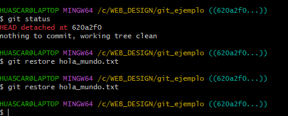
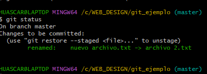
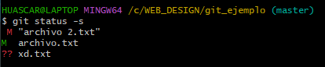
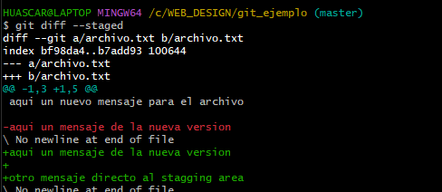
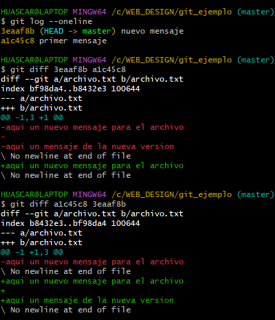
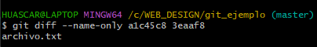
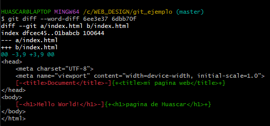

# Git_course
Los primero que hay que hacer en git es configurar el alias y el correo electronico

3 tipos de jerarquias 
- sistema
- global
- local

local es solo para un repositorio, global en para todos los repositorios dentro de un usuario, mientras que sistema es para todos los usuarios

git config (accede a las configuraciones ) 

git config --global (accede a las configuraciones globales) (existen, system, global y local)

git config --global user.name (usuario.nomre es coomo el atributo(nombre) del usuario)

git config --global user.email 

git config --list (nos muestra como esta configurado nuestro git, aqui podemos ver nuestro nombre como email)

git config --global --list (configuracion del git a nivel global)

clear (limpia la pantalla)

git config --global core.editor "code --wait" (esto lo enlaza al visual studio code y espera a que el git se cierre(tiene que ver con los commits))

git config --global color.ui true (da color a los que sale por el terminal)

git config --global core.autocrlf true (soluciona los problemas de compatibilidad entre linux y windows (\r\n))

(cuando estamos en mac, linux o UNIX, entonces cambiamos el true a input)

## REPOSITORIO
el repositorio es el lugar donde guardamos todo y donde tenemos todo para poder administrarlo 

AREAS
- Area de trabajo
- Stagging area (donde subimos los cambios que posteriormente enviaremos al repositorio)
- repositorio

## comandos de linux
- mkdir (crear carpeta)
- rmdir (eliminar carpeta)
- ls (lista)
- ls -a (lista con los elementos oculto)
- pwd (muestra la dirrecion o path)

## comandos de git iniciales(aparte de la configuracion inicial)
- git add archivo (si quieres cargar todos los archivos, entonces pones .) (lo envias al stagging area) (si quieren agregar mas de un archivo solamente le dan espacio al primero y continuan con le siguiente ej. git add archivo1.txt archivo2.txt)
- git status (muestra la rama y los commits - informacion del area de trabajo y la preparacion)
- git status -s O git status --short (muestra una forma resumidad del status)
- git rm --cached archivo (lo quita del changes to be committed) (puedes hacer lo mismo que el add para eliminar varios archivos)
- git commit (hace lo mismo que el de abajo, solamente que con un mensaje largo)
    
/*  
    # Please enter the commit message for your changes. Lines starting
    # with '#' will be ignored, and an empty message aborts the commit.
    #
    # On branch master
    # Changes to be committed:
    #	modified:   hola_mundo.txt
    #
*/
te sale algo asi, cuando es commit en el editor que haya puesto (en =mi caso visual code), puedes eliminarlo y poner el mensaje, no te olvidesa de guardar el mensaje

- git commit -m "message" -a (el -a es opcional, se cra un commit, lo cual esta en el repositorio)
- git commit -a (hace un salto directo del area de trabajo al repo)

## ejemplo en el repo git_ejemplo 

la rama MASTER esta como estandar

Existen dos tipos de archivos para los commits
- untracked files (archivos que no se cargartan al stagging area)
- changes to be commited (archivos que si se cargaran al stagging area)

## git restore chekout y mas
haremos una prueba eliminando un archivo que ya esta en el repo
    Changes not staged for commit:
    (use "git add/rm <file>..." to update what will be committed)
    (use "git restore <file>..." to discard changes in working directory)
    deleted:    hola_mundo.txt
nos indica que hay cambios importantes en un archivo (deleted), si de verdad queremos que se eliminar entonces agregamos la eliminacion con el add y commit.
- git restore archivo (en caso de que lo hayamos eliminado y estan en el stagging area si ya lo pusiste enviaste al repo entonces volve en el tiempo)

- git checkout archivo (lo que hace es restaurar la ultima version del commit - en el caso de que este en el stagging area, no se cambia)
- git reset --hard (en el caso de que ya lo pusiste en el stagging area, puedes deshacer los cambios con este comando. borra lo del stagging area - hay que tener cuidado con esto)

## como cambiar el nombre dle archivo
git mv archivo nuevo_nombre_archivo

 

si cambiamos de nombre desde el ordenador, el git no lo reconoce, por ende, creera que se elimino. cuando hacemos un checkout lo "restaura" (en realidad como que crea otro, el archivo con nombre diferente sigue ahi y es como si fuera un nuevo archivo)

## git status -s 

el M en rojo = modificado 
el M en verde = modificado en el stagging area
?? = archivo nuevo o extrano para el stagging area

el A verde = se agrego un archivo en el stagging area

nota: si borramos el archivo .git, se borra el repositorio, tomar en cuenta.

## git show
git show archivo (muestra el contenido del archivo en la version del repositorio, es decir, del commiteado)

## git diff
- git diff --staged (muestra la comparacion del contenido de lo que esta en el stagging area y el repo)

el rojo es el commiteado y el verde es el que esta en el stagging

- git diff hash1 hash2

difieren en cuanto al orden en que se le ponen

- git diff --name-only hash1 hash2 (muestra los nombres de los aechivos que cambiaron)

- git diff --word-diff (hace la comparacion entre hashes o commmits tomando en cuenta el contenido)

el primer has es el rojo y el segundo es el verde

## git log
- git log es registro de todos los commits que se realizan 
- git log --oneline es una version corta de los commits

normalmente con 7 caracteres ya lo puedes identificar, de esta forma no  tendras que poner todo el hash. pero si es un repo con demasiados commits y no quieres poner todo, entonces se sugiere este comando

- git config --global core.abbrev cantidad_caracteres 